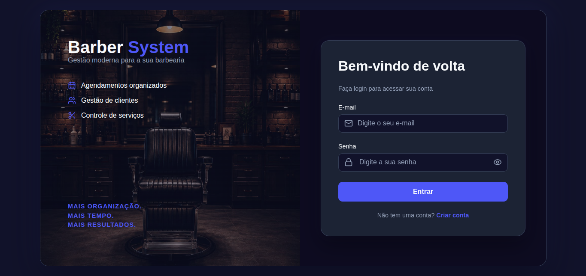
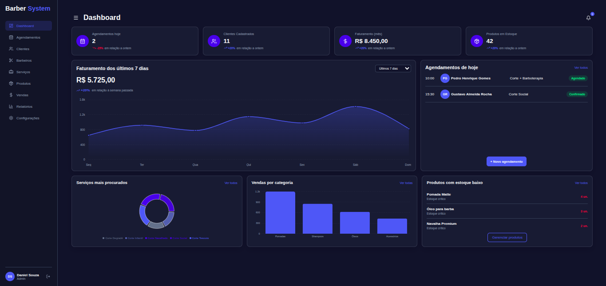
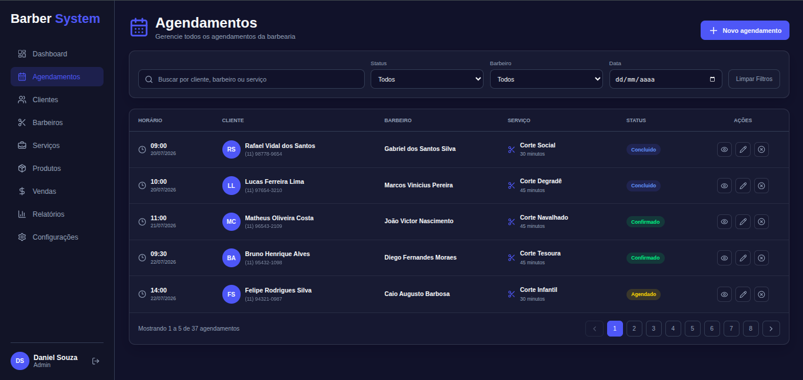
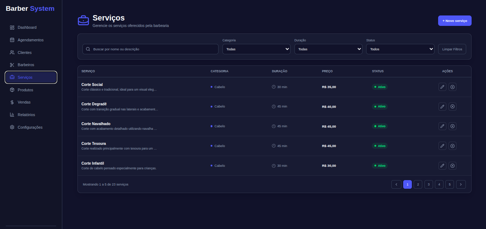
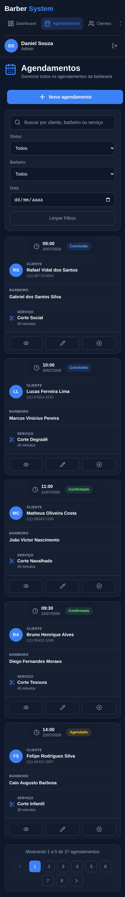

# Barber System

Sistema web Full Stack desenvolvido para gerenciamento de uma barbearia, reunindo autenticação, controle de acesso, gerenciamento de serviços, barbeiros, clientes e agendamentos em uma única aplicação.

O projeto foi desenvolvido com foco em simular uma aplicação administrativa real, utilizando um frontend em React integrado a uma API REST própria desenvolvida em Node.js.

## Aplicação

**Frontend:**  
https://barber-system-web-puce.vercel.app

A aplicação está hospedada na Vercel e consome uma API REST hospedada separadamente no Railway.

> A API e o banco de dados utilizam serviços de hospedagem que podem entrar em modo de inatividade ou sofrer alterações de disponibilidade dependendo dos limites do plano utilizado.

## Sobre o projeto

O Barber System surgiu como um projeto de estudo e portfólio com o objetivo de aplicar, em uma aplicação completa, conhecimentos de desenvolvimento frontend e backend.

O sistema possui diferentes níveis de acesso. Usuários administrativos têm acesso às funcionalidades de gerenciamento da barbearia, enquanto clientes possuem uma experiência restrita às funcionalidades relacionadas aos próprios agendamentos.

Além da implementação das funcionalidades, o projeto envolveu decisões relacionadas à organização da aplicação, autenticação, autorização, integração entre frontend e backend, persistência de dados, tratamento de erros, responsividade e deploy.

### Autenticação


### Dashboard administrativo


### Gerenciamento de agendamentos


### Gerenciamento de serviços


### Interface responsiva


## Funcionalidades

### Autenticação e autorização

- Cadastro de usuários
- Login utilizando e-mail e senha
- Autenticação baseada em JWT
- Persistência da sessão no frontend
- Rotas privadas
- Controle de acesso baseado em roles
- Diferenciação entre usuários administrativos e clientes

### Agendamentos

- Listagem de agendamentos
- Criação de novos agendamentos
- Visualização dos detalhes
- Edição e reagendamento
- Cancelamento
- Filtros para localização de agendamentos
- Exibição dos agendamentos relacionados ao usuário
- Controle de acesso às operações conforme o tipo de usuário

### Serviços

- Listagem dos serviços oferecidos
- Cadastro de serviços
- Edição
- Exclusão
- Busca por nome ou descrição
- Filtros por categoria, duração e status
- Paginação
- Visualização de preço, duração, categoria e disponibilidade

### Usuários e barbeiros

- Gerenciamento de usuários
- Cadastro e gerenciamento de barbeiros
- Associação das informações necessárias aos agendamentos
- Diferentes permissões de acesso à aplicação

### Dashboard

O painel administrativo apresenta uma visão geral da operação da barbearia, incluindo:

- quantidade de agendamentos
- clientes cadastrados
- informações de faturamento
- produtos em estoque
- agendamentos do dia
- gráficos de faturamento
- serviços mais procurados
- vendas por categoria
- produtos com estoque baixo

Atualmente, parte das informações do dashboard é demonstrativa.

Os gráficos e alguns indicadores financeiros/operacionais ainda utilizam dados estáticos e **não representam dados reais calculados pela API**. A integração dessas informações com dados reais do sistema está planejada para uma versão futura.

## Tecnologias

### Frontend

- React
- Vite
- JavaScript
- React Router
- Context API
- Axios
- CSS
- Lucide React

### Backend

A aplicação consome uma API REST própria desenvolvida especificamente para o projeto utilizando:

- Node.js
- Express
- Sequelize
- MariaDB
- JWT
- Multer
- bcrypt

### Infraestrutura

- Vercel — deploy do frontend
- Railway — deploy da API e infraestrutura de produção
- Git e GitHub — versionamento e hospedagem do código

## Arquitetura

O projeto possui frontend e backend separados.

```text
React / Vite
     |
     | HTTP / Axios
     v
API REST - Node.js / Express
     |
     | Sequelize
     v
MariaDB
```

O frontend é responsável pela interface e experiência do usuário, enquanto regras de negócio, autenticação, autorização e acesso aos dados são processados pela API.

Essa separação permite que o frontend não tenha acesso direto ao banco de dados.

## Autenticação

Após o login, a API valida as credenciais do usuário e retorna um token JWT.

O frontend armazena o token e o envia nas requisições autenticadas:

```text
Authorization: Bearer <token>
```

No backend, middlewares verificam o token antes de permitir o acesso às rotas protegidas.

No frontend, o estado de autenticação é compartilhado através da Context API, enquanto rotas privadas impedem o acesso a páginas que exigem autenticação.

Além da autenticação, o sistema utiliza roles para determinar quais áreas da aplicação cada usuário pode acessar.

## Responsividade

A interface foi desenvolvida para funcionar em diferentes tamanhos de tela.

Foram realizados ajustes específicos para:

- monitores desktop
- notebooks
- tablets
- smartphones

Elementos como navegação, cards do dashboard, tabelas, filtros, formulários e gráficos reorganizam seu layout conforme o espaço disponível.

Em dispositivos menores, algumas tabelas são transformadas em layouts semelhantes a cards para evitar dependência de rolagem horizontal.

## Estrutura do frontend

A aplicação foi organizada separando responsabilidades entre páginas, componentes reutilizáveis, layouts, contextos e serviços.

```text
src/
├── assets/
├── components/
├── contexts/
├── layouts/
├── pages/
├── routes/
├── services/
|── styles/
|── utils/
```

`components` contém elementos reutilizados pela aplicação.

`contexts` concentra estados compartilhados, incluindo autenticação.

`layouts` define estruturas compartilhadas entre diferentes páginas.

`pages` contém as principais telas da aplicação.

`routes` concentra a configuração das rotas e proteção de páginas.

`services` contém a configuração utilizada para comunicação com a API.

`styles` contém a estilização global e regras do css.

`utils` reúne funções auxiliares e formatações reutilizadas pelo sistema.

## Executando localmente

Clone o repositório:

```bash
git clone <https://github.com/danielalves5612/barber-system-web>
```

Entre no diretório:

```bash
cd barber-system-web
```

Instale as dependências:

```bash
npm install
```

Inicie o ambiente de desenvolvimento:

```bash
npm run dev
```

Por padrão, o Vite disponibilizará a aplicação em um endereço local.

Para utilizar todas as funcionalidades, também é necessário que a API do Barber System esteja disponível e que a URL utilizada pelo Axios esteja configurada corretamente.

## Build

Para gerar a versão de produção:

```bash
npm run build
```

O Vite gera os arquivos otimizados dentro do diretório `dist`.

## Próximas melhorias

A versão atual representa a primeira versão funcional do Barber System. Algumas melhorias planejadas para versões futuras incluem:

- integrar os gráficos do dashboard aos dados reais da API
- calcular faturamento e indicadores diretamente a partir dos agendamentos e serviços
- substituir outros dados demonstrativos do dashboard por informações reais
- implementar gerenciamento real de estoque e produtos
- desenvolver o módulo de vendas
- aprimorar relatórios administrativos
- adicionar indicadores e métricas mais detalhados
- aprimorar o sistema de notificações
- melhorar validações e feedbacks apresentados ao usuário
- ampliar os testes da aplicação
- adicionar testes automatizados no frontend e backend
- continuar aprimorando acessibilidade e experiência em dispositivos móveis
- implementar novas funcionalidades administrativas conforme a evolução do sistema

## Objetivo

Mais do que reproduzir uma interface, o objetivo do projeto foi construir e publicar uma aplicação completa, passando pelas diferentes etapas envolvidas no desenvolvimento de um sistema web:

```text
Interface
    ↓
Autenticação
    ↓
Controle de acesso
    ↓
API REST
    ↓
Regras de negócio
    ↓
Banco de dados
    ↓
Deploy
```

O Barber System continuará evoluindo conforme novos conceitos e tecnologias forem estudados.

## Autor

**Daniel Alves**

Projeto desenvolvido para estudo, prática de desenvolvimento Full Stack e composição de portfólio profissional.